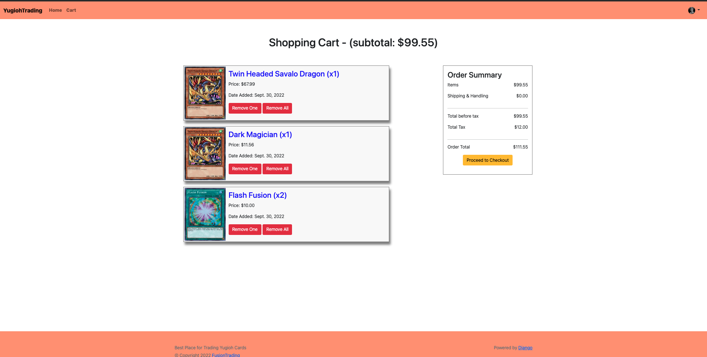

# Trading-Card

## What is Used
- Python 3.10
- Django
- Stripe (Single Payment)
- crispy-bootstrap5

## Project Photos

### Home Page


### Product Detail


### Shopping Cart


### Stripe Checkout


## How to Start
Create Virtual Environment:
```bash
$ python3.10 -m venv venv
$ source venv/bin/activate
$ pip install -r requirements.txt
```

Inside `src/config/`, create `.env` file and create the following environment variable:
```bash
SECRET_KEY
DEBUG
STRIPE_PUBLISHABLE_KEY
STRIPE_SECRET_KEY
STRIPE_ENDPOINT_SECRET
DOMAIN_URL
```

For the local development, set `DEBUG` and `DOMAIN_URL` to `True` and `http://localhost:8000/`, repectively

`SECRET_KEY` is a Django secret key

`STRIPE_PUBLISHABLE_KEY`, `STRIPE_SECRET_KEY`, and `STRIPE_ENDPOINT_SECRET` must be retrieved from the Stripe (please refer to Stripe Integration section).

We can `cd` in to `./src`.

Before we can start we need to make migrations and create super user:
```bash
$ python manage.py makemigrations
$ python manage.py migrate
$ python manage.py createsuperuser
```

Enter email address and password.

We can start the application with following command:

```bash
$ python manage.py runserver
```

That's it. Have fun!

## Stripe Integration

Stripe integration was based on [this tutorial](https://testdriven.io/blog/django-stripe-tutorial/).